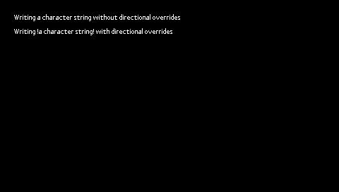

Font Custom Layout
==================

Since the UI Pack `14.1.1 <https://docs.microej.com/en/latest/VEEPortingGuide/uiChangeLog.html#section-ui-changelog-14-1-1>`_ and `MicroUI 3.6.0 <https://repository.microej.com/modules/ej/api/microui/3.6.0/>`_, it is possible to draw strings using a custom layout engine.

Requirements
------------

The example requires a minimal configuration:

- A VEE Port with the UI Pack 14.1.1 or later.

Set-Up
------

- Import the project `font-custom-layout <application>`_ in your favorite IDE.

Execution
---------

- Set the VEE Port used to execute the application in `build.gradle.kts <application/build.gradle.kts>`_ (see `SDK 6 documentation <https://docs.microej.com/en/latest/SDK6UserGuide/selectVeePort.html#select-a-vee-port>`_).

- Run the application ``custom-font-layout``.

  - Observe the string rendered without the custom layout functions.

- Modify your VEE Port to use the custom layout functions.

  - Add the files of the `frontpanel directory <frontpanel>`_ to the front panel project of your VEE Port.

    - ``frontpanel/src/main/java/com/microej/example/CustomLayoutDrawer.java``
    - ``frontpanel/src/main/resources/META-INF/services/ej.microui.display.UIDrawing``

  - Add the C source file ``ui_custom_layout.c`` from `the abstraction layer directory <abstractionlayer>`_ to your build path.
  - Build the VEE Port.

- Run the application ``custom-font-layout`` again.

  - Observe that the string rendered with the custom layout functions displays right-to-left text properly.

Principle
---------

The files ``ui_custom_layout.c`` and ``CustomLayoutDrawer.java`` contain implementations of ``UI_DRAWING_drawString`` and ``DisplayDrawer.drawString``,
which provide basic handling Unicode characters allowing interweaving right-to-left text with left-to-right text.
More detailed information is available in the documentation and comments included in these files.

.. ReStructuredText
.. Copyright 2024-2025 MicroEJ Corp. All rights reserved.
.. Use of this source code is governed by a BSD-style license that can be found with this software.
